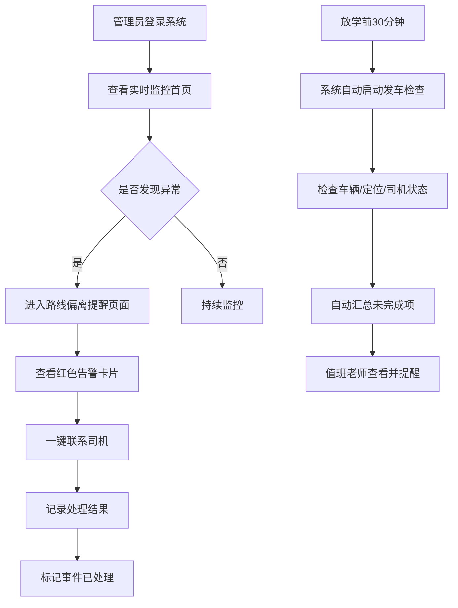

## 1. 产品概述

校车实时护航台是面向学校校车管理员的Web端实时管理系统，将早晚学生接送过程全流程数字化管理，解决校车运行状态监控不及时、路线偏离难发现、发车准备工作疏漏等痛点。

- 目标用户：学校校车管理员、值班老师
- 核心价值：实时掌握所有校车动态，及时处置异常情况，确保学生接送安全有序

## 2. 核心功能

### 2.1 用户角色

| 角色 | 登录方式 | 核心权限 |
|------|----------|----------|
| 校车管理员 | 账号密码登录 | 全部功能：实时监控、异常处置、发车检查 |
| 值班老师 | 账号密码登录 | 查看实时监控、发车检查结果汇总 |

### 2.2 功能模块

1. **实时监控首页**：校车地图分布、车辆信息卡片、多维筛选、车辆详情弹窗
2. **路线偏离提醒**：异常事件列表、红色风险卡片、一键联系司机、处理结果记录
3. **放学前准备**：车辆上线检查、定位状态、司机发车确认、未完成项自动汇总

### 2.3 页面详情

| 页面名称 | 模块名称 | 功能描述 |
|----------|----------|----------|
| 实时监控首页 | 顶部导航栏 | 系统名称、用户信息、页面切换 |
| 实时监控首页 | 统计概览 | 在途车辆数、已完成接送、待发车、异常告警数 |
| 实时监控首页 | 地图区域 | 校车实时位置标记、线路展示、车辆状态颜色区分 |
| 实时监控首页 | 筛选栏 | 按年级、线路、迟到风险筛选 |
| 实时监控首页 | 车辆列表 | 车牌、司机、照管员、车内人数、当前线路、状态标签 |
| 实时监控首页 | 车辆详情弹窗 | 下一站名称、预计到站时间、已上车学生名单、行驶轨迹 |
| 路线偏离提醒 | 异常概览统计 | 路线偏离数、长时间停留数、接近禁停区数 |
| 路线偏离提醒 | 异常事件卡片 | 红色醒目标识、异常类型、发生时间、车辆信息、异常原因描述 |
| 路线偏离提醒 | 处置操作区 | 一键拨打司机电话、标记已联系、填写处理结果 |
| 路线偏离提醒 | 处理历史 | 已处理事件列表、处理人、处理时间、处理结果 |
| 放学前准备 | 检查时间轴 | 距离放学倒计时、检查阶段提示 |
| 放学前准备 | 车辆检查列表 | 车辆状态（在线/离线）、定位状态（正常/异常）、司机确认状态 |
| 放学前准备 | 未完成汇总 | 自动汇总未上线车辆、定位异常车辆、未确认司机，发送给值班老师 |
| 放学前准备 | 一键提醒 | 批量短信/消息提醒未确认司机 |

## 3. 核心流程

### 3.1 早间接送监控流程

管理员登录系统 → 首页查看所有校车实时位置 → 通过筛选定位高风险车辆 → 点击车辆查看详情和学生名单 → 发现异常切换至路线偏离页面处置

### 3.2 异常处置流程

系统自动检测异常 → 路线偏离页面生成红色告警卡片 → 管理员查看异常详情 → 一键联系司机 → 填写处理结果并标记完成

### 3.3 放学前准备流程

放学前30分钟系统自动启动检查 → 逐一检查车辆上线/定位/司机确认 → 自动汇总未完成项 → 值班老师查看汇总并提醒相关人员 → 全部就绪后车辆发车

## 4. 用户界面设计

### 4.1 设计风格

- **主色调**：深海军蓝 `#0A2342`，传达专业、安全、可信赖感
- **辅助色**：警示红 `#E63946`（异常告警）、安全绿 `#2A9D8F`（正常状态）、警示黄 `#E9C46A`（待处理）、信息蓝 `#457B9D`
- **背景色**：深色主题 `#0F172A`，数据可视化更清晰，适合长时间监控
- **按钮风格**：圆角矩形（8px），实心按钮配微阴影，悬停有上浮效果
- **字体**：标题使用 "Noto Sans SC" 700，正文使用 "Noto Sans SC" 400/500，数字使用等宽字体增强数据感
- **布局风格**：左侧导航栏 + 主内容区，卡片式模块化布局，信息层级分明
- **图标风格**：线性图标，统一2px描边，与整体简洁专业风格保持一致

### 4.2 页面设计概览

| 页面名称 | 模块名称 | UI元素 |
|----------|----------|--------|
| 实时监控首页 | 统计概览 | 渐变色数据卡片、图标+数字组合、状态指示灯、微动效 |
| 实时监控首页 | 地图区域 | 暗色地图底图、动态车辆标记（脉冲动画）、线路折线、点击弹出信息窗 |
| 实时监控首页 | 筛选栏 | 下拉选择器、标签式筛选、搜索框、筛选结果计数 |
| 实时监控首页 | 车辆列表 | 横向信息卡片、状态色标签、头像占位、数据角标 |
| 实时监控首页 | 详情弹窗 | 遮罩层弹窗、分栏布局、学生名单列表、倒计时动画 |
| 路线偏离提醒 | 异常卡片 | 红色渐变边框、告警图标闪烁动画、紧急程度标签、时间线 |
| 路线偏离提醒 | 操作区 | 主操作按钮高亮、电话图标、结果输入框、时间戳记录 |
| 放学前准备 | 时间轴 | 垂直时间线、进度指示、倒计时数字动画、阶段状态颜色 |
| 放学前准备 | 检查列表 | 三列状态（在线/定位/确认）、复选框样式、批量操作栏 |

### 4.3 响应式

- 桌面端优先设计（1440px及以上）
- 平板端（1024px）：导航栏收起为图标模式，地图和列表调整比例
- 移动端暂不做强制适配，保持最小可用

### 4.4 动效规范

- 车辆标记：呼吸脉冲动画，正常状态绿色脉冲，异常状态红色快速闪烁
- 页面切换：淡入淡出过渡（300ms ease-out）
- 卡片悬停：y轴-2px位移 + 阴影加深（200ms）
- 告警出现：从右侧滑入 + 轻微震动效果
- 倒计时：数字跳动动效
