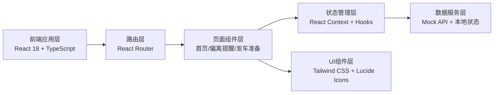

## 1. 架构设计



## 2. 技术描述

- **前端框架**: React@18 + TypeScript
- **构建工具**: Vite@5
- **样式方案**: TailwindCSS@3 + CSS 变量
- **路由管理**: React Router@6
- **图标库**: Lucide React
- **地图方案**: 纯CSS/SVG实现模拟地图（无需外部地图服务）
- **数据方案**: 前端Mock数据 + React Context状态管理
- **动画方案**: CSS原生动画 + framer-motion（轻量交互）

## 3. 路由定义

| 路由 | 页面 | 说明 |
|------|------|------|
| `/` | 实时监控首页 | 校车地图分布、车辆列表、筛选、详情弹窗 |
| `/alerts` | 路线偏离提醒 | 异常事件列表、处置操作、处理历史 |
| `/preparation` | 放学前准备 | 检查时间轴、车辆检查列表、未完成汇总 |

## 4. 核心数据类型定义

```typescript
// 校车信息
interface Bus {
  id: string;
  plateNumber: string;
  driver: {
    name: string;
    phone: string;
    avatar?: string;
  };
  attendant: {
    name: string;
    phone: string;
  };
  routeId: string;
  routeName: string;
  currentPassengers: number;
  capacity: number;
  status: 'running' | 'stopped' | 'offline' | 'delay';
  position: {
    lat: number;
    lng: number;
    x: number;
    y: number;
  };
  grades: string[];
  nextStop: {
    name: string;
    eta: string;
    etaMinutes: number;
  };
  onboardStudents: Student[];
  lastUpdate: Date;
}

// 学生信息
interface Student {
  id: string;
  name: string;
  grade: string;
  className: string;
  avatar?: string;
  boardTime?: Date;
}

// 线路信息
interface Route {
  id: string;
  name: string;
  stops: Stop[];
  color: string;
}

// 站点信息
interface Stop {
  id: string;
  name: string;
  position: { x: number; y: number };
  scheduledTime: string;
}

// 异常告警
interface Alert {
  id: string;
  busId: string;
  busPlateNumber: string;
  type: 'route_deviation' | 'long_stop' | 'near_no_stop';
  typeName: string;
  level: 'high' | 'medium' | 'low';
  description: string;
  location: string;
  timestamp: Date;
  status: 'pending' | 'processing' | 'resolved';
  handler?: string;
  handleResult?: string;
  handleTime?: Date;
}

// 发车检查项
interface PreparationCheck {
  busId: string;
  busPlateNumber: string;
  driverName: string;
  isOnline: boolean;
  isGpsNormal: boolean;
  isDriverConfirmed: boolean;
  confirmTime?: Date;
  remark?: string;
}
```

## 5. 项目目录结构

```
src/
├── components/          # 通用UI组件
│   ├── layout/         # 布局组件（侧边栏、导航等）
│   ├── bus/            # 校车相关组件
│   ├── alerts/         # 告警相关组件
│   └── common/         # 通用组件（卡片、按钮、标签等）
├── pages/              # 页面组件
│   ├── Dashboard.tsx   # 实时监控首页
│   ├── Alerts.tsx      # 路线偏离提醒
│   └── Preparation.tsx # 放学前准备
├── context/            # React Context状态管理
│   └── AppContext.tsx
├── data/               # Mock数据
│   ├── buses.ts
│   ├── alerts.ts
│   └── preparation.ts
├── types/              # TypeScript类型定义
│   └── index.ts
├── hooks/              # 自定义Hooks
│   └── useTimer.ts
├── utils/              # 工具函数
├── App.tsx
├── main.tsx
└── index.css
```

## 6. 视觉与交互动效实现

- **CSS变量**: 在 `index.css` 中定义全局主题色变量
- **车辆脉冲动画**: 使用 `@keyframes` + `box-shadow` 实现呼吸效果
- **告警闪烁**: 使用 `animation` 实现红色边框闪烁
- **页面过渡**: 使用CSS `transition` 实现页面切换淡入
- **地图实现**: 使用SVG绘制校园及周边道路，校车位置用绝对定位的圆点标记
